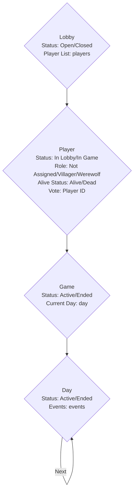

# Game loop

```mermaid
flowchart TD
    Start[Create Lobby] -->|Players Join Lobby|A[Setup Lobby(Model: Lobby, Status: Open, Player List: players)]
    A -->|Start Game|B[Game Starts (Model: Game, Status: Active)]
    B -->|Assign Roles|C1[Player Model Updates (Status: In Game, Role: Assigned)]
    C1 -->|Start Day|D[Day Starts (Model: Day, Status: Active)]
    D -->|Cast Votes|E[Player Model Updates (Vote Cast)]
    E -->|Resolve Votes|F[Kill Player (Model: Player, Status: Dead) or Continue with Next Day]
    F -->|Check Win Condition|G[Game Status Update (Villagers Win or Wolves Win)]
    G -->|If Game Continues|D
    G -->|If Game Ends|End[Game Ends]
```

# Models


