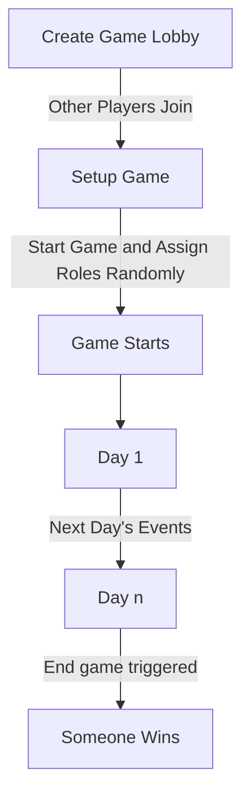
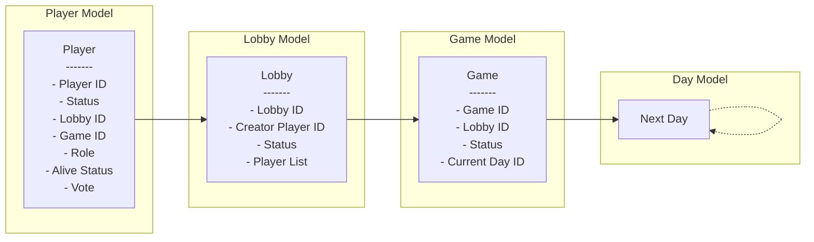

# Game loop

Below is a rough outline of the game loop:

# Models

Simple overview.

Currently miss a lot of details.

Doesn't include any specific things related to blockchains/dojo for now (e.g. player addresses, etc.):

